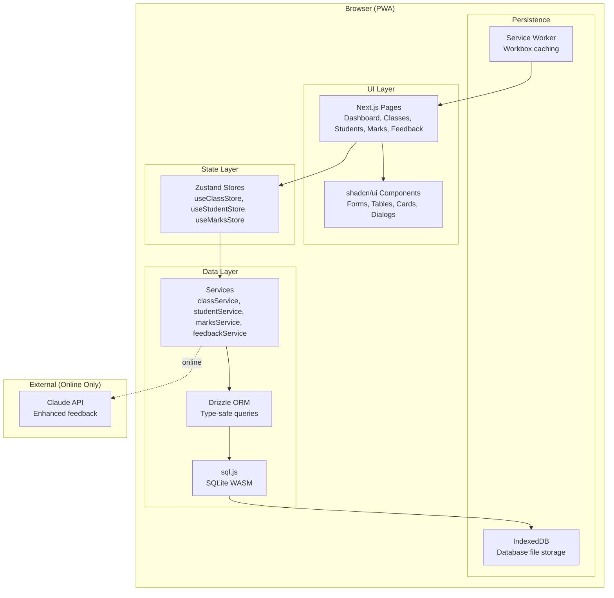

# Phase 1 Architecture — Teacher Assistant PWA

## Intent

Offline-first PWA with local SQLite database. All core operations work without network. AI feedback is enhanced when online, falls back to templates offline.

## Architecture Diagram





## Layer Responsibilities

| Layer | Responsibility | Key Technologies |
|-------|---------------|------------------|
| UI | Render pages, handle user input | Next.js App Router, shadcn/ui |
| State | Reactive state, cache DB reads | Zustand |
| Services | Business logic, orchestration | TypeScript modules |
| Data | Database operations | Drizzle ORM, sql.js |
| Storage | Persistence, offline | IndexedDB, Service Worker |
| External | AI enhancement | Claude API (optional) |

## Data Flow

### Write Path
```
User Input → Component → Store Action → Service → Drizzle → sql.js → IndexedDB
```

### Read Path
```
IndexedDB → sql.js → Drizzle → Service → Store → Component (reactive)
```

### Online Enhancement
```
Service → Check Online → Claude API → Enhanced Response
                     ↓ (offline)
               Template Fallback
```

## Review Notes

*Space for JD feedback during checkpoint review*

---
*Generated: 2026-03-02*
