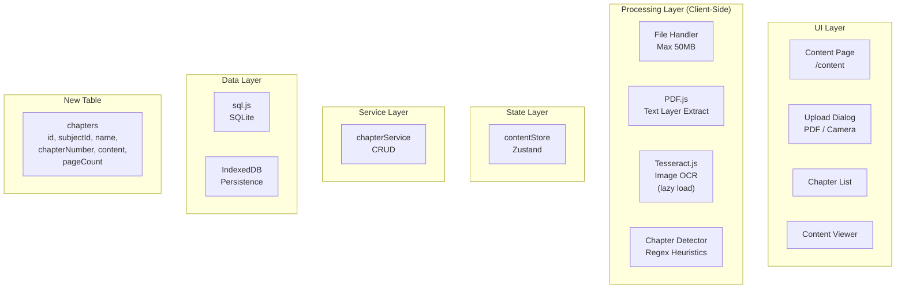

# Phase 2 Architecture — Content Upload & OCR

## Intent

Enable teachers to upload textbook content (PDFs from Microsoft Lens, direct photos) with text extraction, storing extracted text in SQLite for worksheet generation in Phase 3.

## Architecture Diagram



**SVG Render:** [ARCHITECTURE.svg](./ARCHITECTURE.svg)

## Processing Pipeline

### Primary Path: Microsoft Lens PDF (99% of usage)

```
User scans with Lens → PDF with embedded text layer → Upload to app
    → PDF.js extracts text (instant, 100% accurate) → Chapter auto-detect → SQLite
```

### Fallback Path: Direct Photo

```
User takes photo → Upload image → Tesseract.js OCR (~95% accuracy)
    → Chapter auto-detect → SQLite
```

## Technology Choices

| Component | Choice | Rationale |
|-----------|--------|-----------|
| PDF text extraction | **PDF.js** | Standard library, handles Lens PDFs perfectly |
| Image OCR | **Tesseract.js** | Free, offline, good for clean photos |
| Chapter detection | **Regex heuristics** | Pattern match "Chapter X", "Unit X", section numbers |
| Worker strategy | **Lazy load Tesseract** | 4MB WASM only loaded if user uploads image |

## Cost Analysis

| Scenario | Method | Cost |
|----------|--------|------|
| 30 chapters/month from Lens PDFs | PDF.js | **$0** |
| 30 chapters/month from photos | Tesseract.js | **$0** |
| **Total** | | **$0/month** |

## New Database Schema

```sql
CREATE TABLE chapters (
  id TEXT PRIMARY KEY,
  subject_id TEXT NOT NULL REFERENCES subjects(id) ON DELETE CASCADE,
  name TEXT NOT NULL,
  chapter_number INTEGER NOT NULL,
  content TEXT NOT NULL,
  page_count INTEGER DEFAULT 1,
  source_type TEXT NOT NULL,  -- 'pdf' | 'image'
  difficulty TEXT,            -- 'easy' | 'medium' | 'hard' (manual tag)
  created_at TEXT NOT NULL,
  updated_at TEXT NOT NULL
);

CREATE INDEX idx_chapters_subject ON chapters(subject_id);
```

## New Files

```
src/
├── app/(app)/content/
│   ├── page.tsx                  # Content list by subject
│   └── [id]/page.tsx             # Chapter detail view
├── components/content/
│   ├── upload-dialog.tsx         # PDF/camera upload UI
│   ├── chapter-card.tsx          # Chapter list item
│   ├── content-viewer.tsx        # Text display with search
│   └── processing-progress.tsx   # Upload progress indicator
├── services/
│   ├── chapter-service.ts        # Chapter CRUD
│   └── content-processor.ts      # PDF.js + Tesseract orchestration
├── stores/
│   └── content-store.ts          # Content state management
└── lib/
    ├── pdf-extractor.ts          # PDF.js wrapper
    ├── ocr-processor.ts          # Tesseract.js wrapper (lazy)
    └── chapter-detector.ts       # Regex-based chapter detection
```

## Integration Points

| Existing File | Change |
|---------------|--------|
| `src/lib/db/schema.ts` | Add `chapters` table |
| `src/lib/db/database.ts` | Add migration |
| `src/components/layout/bottom-nav.tsx` | Add content nav item |
| `package.json` | Add `pdfjs-dist`, `tesseract.js` |

## Chapter Detection Heuristics

```typescript
const CHAPTER_PATTERNS = [
  /^chapter\s+(\d+)/i,           // "Chapter 1", "CHAPTER 5"
  /^unit\s+(\d+)/i,              // "Unit 1", "UNIT 3"
  /^lesson\s+(\d+)/i,            // "Lesson 1"
  /^(\d+)\.\s+[A-Z]/,            // "1. Introduction"
  /^module\s+(\d+)/i,            // "Module 1"
];

// Fallback: treat each PDF as single chapter, user can split manually
```

## Offline Support

| Feature | Works Offline |
|---------|---------------|
| View existing chapters | Yes |
| Upload PDF | Yes (PDF.js is client-side) |
| Upload image + OCR | Yes (Tesseract.js WASM) |
| Chapter detection | Yes (regex) |
| Edit chapter content | Yes |

## Review Notes

*Space for JD edits and comments during checkpoint review.*

---
*Phase 2 Architecture — Teacher Assistant PWA*
