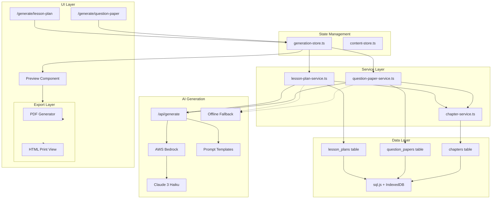

# Phase 3 Architecture — Generation

## Intent

Add AI-powered generation capabilities for lesson plans and question papers, building on Phase 2's chapter content system. Teachers select chapters, configure parameters, and receive structured educational content.

## Architecture Diagram



**Legend:**
- 🟢 Green: Existing (Phase 1-2)
- 🔵 Blue: New (Phase 3)
- 🔴 Pink: External service



## Key Components

### New Tables

**lesson_plans**
- id, chapterId, subjectId, name
- duration (minutes), objectives (JSON)
- sections (JSON: intro, content, activities, assessment)
- materials (JSON), createdAt, updatedAt

**question_papers**
- id, chapterId[], subjectId, name
- totalMarks, duration, difficulty
- sections (JSON: Section A/B/C with questions)
- answerKey (JSON), createdAt, updatedAt

### New Services

**lesson-plan-service.ts**
- Generate lesson plan from chapter content via Claude API
- Structured prompt with duration, objectives extraction
- Save/update/delete operations

**question-paper-service.ts**
- Generate question paper with marks distribution
- Support preset templates (Unit Test, Term Exam)
- Auto-calculate sections from total marks
- Generate answer key separately

### New UI Routes

- `/generate/lesson-plan` — Select chapter, set duration, generate
- `/generate/question-paper` — Select chapters, set marks, choose template

### AWS Bedrock Integration (Converse API)

**Why Bedrock:**
- Cost-effective: Haiku at ~$0.25/1M input, ~$1.25/1M output
- No separate API key management (uses AWS IAM)
- Enterprise-grade security
- Pay-as-you-go billing

**API Route Pattern:**
```typescript
// src/app/api/generate/route.ts (Next.js Route Handler)
import { BedrockRuntimeClient, ConverseCommand } from "@aws-sdk/client-bedrock-runtime";

const client = new BedrockRuntimeClient({
  region: process.env.AWS_REGION || "us-east-1"
});

const modelId = "anthropic.claude-3-haiku-20240307-v1:0";

export async function POST(request: Request) {
  const { prompt, type } = await request.json();

  const command = new ConverseCommand({
    modelId,
    messages: [{ role: "user", content: [{ text: prompt }] }],
    inferenceConfig: { maxTokens: 4096, temperature: 0.7 }
  });

  const response = await client.send(command);
  return Response.json({
    content: response.output.message.content[0].text
  });
}
```

**Environment Variables:**
- `AWS_ACCESS_KEY_ID` — AWS credentials
- `AWS_SECRET_ACCESS_KEY` — AWS credentials
- `AWS_REGION` — Bedrock region (default: us-east-1)

**Model ID:** `anthropic.claude-3-haiku-20240307-v1:0`

### Export

- HTML-based preview with print stylesheet
- PDF generation via browser print or jsPDF

## Data Flow

1. Teacher selects chapter(s) from content store
2. Configures parameters (duration/marks/template)
3. Service fetches chapter content
4. Client calls `/api/generate` route
5. Route handler invokes Bedrock Converse API with Claude Haiku
6. Structured response parsed and stored in DB
7. Result displayed in preview
8. Teacher edits if needed
9. Export to PDF

## Offline Behavior

- Generation requires internet (AWS Bedrock)
- Show clear "requires internet" message when offline
- Previously generated content viewable offline
- Template-based fallback possible for basic structure (stretch)

## Security Notes

- AWS credentials stored in environment variables (not in client code)
- API route runs server-side only
- No direct client access to Bedrock

## References

- [AWS Bedrock Converse API Docs](https://docs.aws.amazon.com/bedrock/latest/userguide/bedrock-runtime_example_bedrock-runtime_Converse_AnthropicClaude_section.html)
- [Claude on Amazon Bedrock](https://platform.claude.com/docs/en/build-with-claude/claude-on-amazon-bedrock)

## Review Notes

*JD: Add any architecture feedback or changes here*
