# Phase 4 Architecture

## Intent

Phase 4 adds polish features to make the Teacher Assistant PWA production-ready:
1. **Document Formatter** - Parse and format Word documents
2. **Analytics Dashboard** - Visualize student/class performance
3. **Data Export/Import** - Backup and restore all data
4. **Google Drive Sync** - Cloud backup integration

## Architecture Diagram

```mermaid
flowchart TD
    subgraph UI["UI Layer (Next.js App Router)"]
        Home["/"]
        Classes["/classes"]
        Students["/students"]
        Marks["/marks"]
        Generate["/generate"]
        Content["/content"]
        Settings["/settings - NEW"]
    end

    subgraph Components["Component Layer"]
        DocFormatter["Document Formatter - NEW"]
        Analytics["Analytics Dashboard - NEW"]
        ExportImport["Export/Import - NEW"]
        CloudSync["Google Drive Sync - NEW"]
    end

    subgraph Stores["Zustand Stores"]
        AppStore["app-store"]
        ClassStore["class-store"]
        StudentStore["student-store"]
        MarksStore["marks-store"]
        ContentStore["content-store"]
        GenerationStore["generation-store"]
        SettingsStore["settings-store - NEW"]
    end

    subgraph Services["Service Layer"]
        ClassService["class-service"]
        StudentService["student-service"]
        MarksService["marks-service"]
        ChapterService["chapter-service"]
        LessonPlanService["lesson-plan-service"]
        QuestionPaperService["question-paper-service"]
        DocService["doc-formatter-service - NEW"]
        AnalyticsService["analytics-service - NEW"]
        ExportService["export-service - NEW"]
        DriveService["drive-service - NEW"]
    end

    subgraph Storage["Storage Layer"]
        SQLite["sql.js (SQLite)"]
        IndexedDB["IndexedDB Persistence"]
        LocalStorage["LocalStorage (Settings)"]
        GoogleDrive["Google Drive API - NEW"]
    end

    subgraph External["External Dependencies - NEW"]
        Mammoth["mammoth.js (Word parsing)"]
        Recharts["recharts (Charts)"]
        GAPI["Google API Client"]
    end

    %% Existing flows
    UI --> Stores
    Stores --> Services
    Services --> SQLite
    SQLite --> IndexedDB

    %% New Phase 4 flows
    Settings --> SettingsStore
    DocFormatter --> DocService
    DocService --> Mammoth
    Analytics --> AnalyticsService
    AnalyticsService --> Recharts
    ExportImport --> ExportService
    ExportService --> SQLite
    CloudSync --> DriveService
    DriveService --> GoogleDrive
    DriveService --> GAPI

    %% Cross-service dependencies
    AnalyticsService --> MarksService
    AnalyticsService --> StudentService
    ExportService --> ClassService
    ExportService --> StudentService
    ExportService --> MarksService
    ExportService --> ChapterService

    classDef new fill:#e8f5e9,stroke:#4caf50
    class Settings,DocFormatter,Analytics,ExportImport,CloudSync,SettingsStore,DocService,AnalyticsService,ExportService,DriveService,Mammoth,Recharts,GAPI,GoogleDrive new
```

## Key Integration Points

### Wave 1: Document Formatter
- **Library**: mammoth.js for .docx parsing
- **Entry point**: `/settings` page with Document Formatter tab
- **Service**: `doc-formatter-service.ts`
- **Storage**: Formatting presets in LocalStorage or SQLite settings table

### Wave 2: Analytics Dashboard
- **Library**: recharts for data visualization
- **Entry point**: `/` (Home) page with dashboard widgets
- **Service**: `analytics-service.ts`
- **Data sources**: marks-service, student-service aggregations

### Wave 3: Data Export/Import
- **Format**: JSON with versioned schema
- **Service**: `export-service.ts`
- **Coverage**: All tables (classes, subjects, students, marks, chapters, lesson_plans, question_papers)

### Wave 4: Google Drive Sync
- **API**: Google Drive API v3
- **Library**: gapi-script or direct REST
- **Service**: `drive-service.ts`
- **Auth**: OAuth2 with offline access

## Review Notes

_Space for JD edits and feedback_
